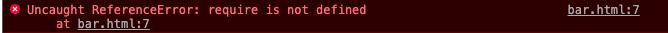

## JavaScript

## ES6

- [ES6 入门教程](http://es6.ruanyifeng.com/)

let
- 属于局部作用域
- 没有覆盖现象

const
- 声明常量，一旦声明不可修改
- 属于局部作用域

模板字符串
- `I am ${name}. `

箭头函数
- (a, b) => {return a + b;}
- 带来的问题1：this的指向发生的变化
- 带来的问题2：arguments不能使用

对象的单体模式

	fav(){
		console.log(111);
	}
	
	等价于
	function fav(){
		console.log(111);
	}
	等价于
	var fav = function(){
		console.log(111);
	}

直接在bar.html全局标签script中使用 require('lodash')会报错，node bar.js倒是可以，涉及到模块化开发

	# bar.js
	var lodash = require('lodash');

	var output = lodash.without([1, 2, 3], 1);
	console.log(output);

## npm

[npm 中文文档](https://www.npmjs.cn/) 包结构能够轻松跟踪依赖项和版本，包括三部分

- [网站](https://www.npmjs.com/)，开发者查找包（package）、设置参数以及管理 npm 使用体验的主要途径
- 注册表 是一个巨大的数据库，保存了每个包（package）的信息
- CLI 开发者通过 CLI 与 npm 打交道

npm 由node.js编写，安装node时，自动安装npm

	node -v # 检查版本
	npm -v  # node 自带包管理器 npm
	npm install npm@latest -g	# 更新到最新版本

**本地安装**
- 自己的模块依赖于某个包，并通过node.js的require加载
- npm install package_name
- 检查本地node_modules是否正常保存该包 
- 如果存在 package.json,则会安装相应的语义化版本规则

	// index.js
	var lodash = require('lodash');
	 
	var output = lodash.without([1, 2, 3], 1);
	console.log(output);

**全局安装**
- 将包作为一个命令行工具，应该安装到全局，这种安装方式后可以在任何目录下使用这个包
- npm install -g package_name

**package.json**
- 列出项目依赖
- 版本控制
- 构建分发更加清晰

	cd ./demo
	npm init --yes or -y
	
	# 配置默认信息
	npm set init.author.email "nining1314@gmail.com"
	npm set init.author.name "ni-ning"
	npm set init.license "MIT"

- dependencies 生产依赖 npm install package_name --save
- devDependencies 开发依赖 npm install package_name --save-dev

**其他命令**

详情参看官方文档

	npm update
	npm uninstall lodash
	
	# 后续可以自己发布一个包到官网

## 淘宝镜像

[淘宝镜像](http://npm.taobao.org/)

	sudo npm install -g cnpm --registry=https://registry.npm.taobao.org
	cnpm install ~