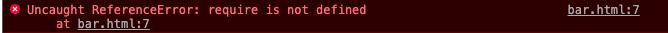

## Vue学习路线

```
html/css/js => es6 => vue基础+组件化开发 => 核心插件vue-router和vuex => 源码+大牛
```

- 框架：类似全家桶，简易DOM体验+发请求+模板引擎+路由功能+数据管理


## 网页基础

### HTML

- html使用标记标签来描述网页 `<标签>`内容`</标签>`
- 开始标签中可设置属性，表示附加信息，一般以键值对的形式出现，如name='value'
- html中的预留字符，如< 空格等，想显示在网页中需转换为实体字符
- url只能使用ASCII字符集，编码使用 % 其后跟随两位的十六进制数来替换非 ASCII 字符，通常使用 + 来替换空格

```
<h1>标题</h1>
<p>段落</p>
<a href='https://www.baidu.com' target='_blank'>超链接</a>
  图片

id		定义元素的唯一id
class	引用一个或多个类名(类名可以样式文件引入)
style	规定元素的样式

<div>块级元素，用于组合其他html元素的容器</div>
<span>内联元素，可用作文本的容器</span>

<script>既可以包含脚本预语句，也可以通过src指向外部脚本</script>
document.getElementById("demo").style.color="#ff0000";

```


### CSS

- css解决内容与表现分离的问题
- css可以大大提高网页开发效率，如控制多重网页的样式和布局
- css规则由两部分构成：选择器，以及一条或多条声明
- 每条声明由一个属性和一个值组成，声明总是以分号结束，以{}括起来
- 盒子模型：margin border padding content

```
p {color: blue; font-size: 12px;}

#para1 {color:red; text-align:center;}
.center {text-align:center;}


a:visited {color: red;}

h1,p,div {color: grepp}		# 分组选择器
p {}			# 为所有p标签指定一个样式
.marked {}		# 为所有class="marked"的标签指定一个样式
.marked p {}	# 为所有class="marked"标签内的p标签指定一个样式
p.marked {}		# 为所有class="marked"的p标签指定一个样式

background-color: gray;

color: red;
text-align: center;
text-decoration: none;

font-family: 'Times New Roman';
font-size: 14px;

height: 14px;		# 元素高度
line-height: 14px	# 行高
```

块元素(block)
- 总是独占一行，表现为另起一行开始，而且其后的元素也必须另起一行显示;
- 宽度(width)、高度(height)、内边距(padding)和外边距(margin)都可控制
内联元素(inline)
- 和相邻的内联元素在同一行;

```
display: none;		# 可以隐藏某个元素，且隐藏的元素不会占用任何空间
display:block  		# 显示为块级元素
display:inline  	# 显示为内联元素
display:inline-block	# 显示为内联块元素，表现为同行显示并可修改宽高内外边距等属性
```

定位元素 position
```
position: fixed;
position: relative;
position: absolute;
```

浮动 float 会使元素向左或向右移动，其周围的元素也会重新排列

对齐
```
元素水平居中，如有宽度的div，可设置 margin: auto
元素中文本居中对齐 text-align: center;
图片居中  img {display:block; margin:auto;}
```

### JavaScript

- 可插入到 HTML 页面，由现代浏览器执行
- 对事件的反映 `<button type="button" onclick="alert('欢迎!')">点我!</button>`
- 改变 HTML 内容 `document.getElementById("demo").innerHTML='Hello Javascript'`
- 改变 HTML 图像 `document.getElementById("demo").src='log.png'`
- 改变 HTML 样式 `document.getElementById("demo").style.color='red'`

事件
- HTML 事件是发生在 HTML 元素上的事情
- HTML 事件可以是浏览器行为，也可以是用户行为
- 事件发生时，可以做些事情，如执行一段 JavaScript 代码 `<some-HTML-element some-event='JavaScript 代码'>`
```
- 页面加载时触发事件
- 页面关闭时触发事件
- 用户点击按钮执行动作
- 验证用户输入内容的合法性
- ...
```

DOM
- 当网页被加载时，浏览器会创建页面的文档对象模型（Document Object Model）
- 通过可编程的对象模型，JavaScript 获得了足够的能力来创建动态的 HTML
```
- JavaScript 能够改变页面中的所有 HTML 元素
- JavaScript 能够改变页面中的所有 HTML 属性
- JavaScript 能够改变页面中的所有 CSS 样式
- JavaScript 能够对页面中的所有事件做出反应
```


其他
- void 是 JavaScript 中非常重要的关键字，该操作符指定要计算一个表达式但是不返回值，如javascript:void(0)

### ES6

let
- 属于局部作用域
- 没有覆盖现象

const
- 声明常量，一旦声明不可修改
- 属于局部作用域

模板字符串
- `I am ${name}. `

箭头函数
- (a, b) => {return a + b;}
- 带来的问题1：this的指向发生的变化
- 带来的问题2：arguments不能使用

对象的单体模式

	fav(){
		console.log(111);
	}
	
	等价于
	function fav(){
		console.log(111);
	}
	等价于
	var fav = function(){
		console.log(111);
	}


直接在bar.html全局标签script中使用 require('lodash')会报错，node bar.js倒是可以，涉及到模块化开发


	# bar.js
	var lodash = require('lodash');

	var output = lodash.without([1, 2, 3], 1);
	console.log(output);


## 指令

v-xxx形式，封装了一些DOM行为，结合属性作为一个暗号，数据驱动视图

- v-text 和 {{}} 一样，都是插入值，直接渲染 innerText
- v-html 既能插入值 又能插入标签 innerHTML
- v-show 本质 display=none，无论显示还是隐藏都渲染开销，用于频繁切换的场景
- v-if v-else 本质是否渲染标签，用户切换较少的场景
- v-bind 操作标签属性值 如v-bind:src，可简写 :src
- v-on 绑定元素事件 如v-on:click='handle()', 可简写 @on:click='handle()'
- 事件对象 $event e.target.value 事件修饰符 @on:click.stop='handle()'
- v-for 数组或对象遍历  v-for="item in menus" :key="item.id"
- v-model 数据双向绑定 input 系列 重点关注 v-model对应的数据类型
- watch 监控 key是属于data对象的属性名 value函数为监控的行为 (newValue, oldValue)
- computed 非常类似@property 逻辑封装 有set和get之分
- filters 过滤器 如 "20.00$"


